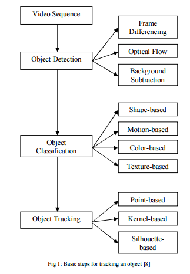

# Attension Is All You Need

## 1. Abstract

- 우수한 Sequence model은 복잡한 RNN 혹은 CNN을 기반으로 한다.
- 뛰어난 Model은 encoder-decoder 연결에 attention mechanism을 사용한다.
- Transformer는 RNN과 CNN을 사용하지 않고, attention mechanism을 사용한다.
- Transformer의 성능 : 독일 번역 → 28.4 BLEU, 프랑스 번역 →41.8 BLEU를 달성

(BLEU : 기계 번역 결과와 사람이 직접 번역한 결과가 얼마나 유사한지 비교하여 번역에 대한 성능 측정 방법)

## 2. Introduction

- Recurrent Model 은 순차적 특성으로 인해 메모리 제약 조건이 있어, Sequence 길이에 제약이 생긴다.
- Attention Mechanism은 다양한 task에서 필수적인 부분이 되었다.
- Transformer를 통해 뛰어난 병렬화와 번역 task에서 뛰어난 성능을 보일 수 있다.

## 3. Background

- Sequence model에서 단어 간의 거리가 멀어지면 관계 학습이 어렵다.
- Self-Attention : 다양한 task(독해, 요약 등)에서 사용된다.
- End-to-end memory network : recurrent attention mechanism 기반으로, 간단한 언어 질의 응답 및 모델링 task를 잘 수행한다.

## 4. Model Architecture

 |
--- |---|

### a. Encoder and Decoder Stacks

- Encoder : 총 6개 층의 stack을 쌓고(논문에서 제시), Multi-Head Attention과 Feed-Forward Network 총 2개의 sub layer를 가진다. 추가로 Gradient Vanishing 문제를 막기 위해 Residual Connection을 통해 해결한다.
(논문에서는 $d_{model} = 512$)
- Decoder : Encoder와 동일하게 6개의 stack(논문에서 제시)을 쌓았다. 동일한 구성에 Masked Multi-Head Attention을 포함한 sub layer 하나가 추가 되었다. Encoder와 동일하게 Residual Connection이 있다.

∵ Gradient Vanishing : layer가 많아지면서 학습 시, 최적해를 찾지 못하는 문제

∵ Residual Connection : Gradient Vanishing 문제를 해결하기 위해, 일부 layer를 건너 뛰어 후반부로 넘어가는 또 다른 경로를 제공해줌 → 추후 backborn에 ResNet 공부할 때 다시 언급

### b. Attention

∵ MatMul : 3차원 이상에서의 벡터곱(내적과 동일)

Query(Q) : 영향을 받는 단어의 변수

Key(K) : 영향을 주는 단어의 변수

Value(V) : 그 영향에 대한 가중치

- Scaled Dot-Product Attention(Self-Attention)
    
    Attention Score 계산 수식
    
    
    
    dot-product attention은 더 빠르고 공간 효율적인 장점이 있어 사용하였다.
    
- Multi-Head Attention
    
    앞서 이야기한 Self-Attention을 다중으로 구현하여 Concat한 형태이다.
    
    이는 두 가지의 장점을 가진다고 한다.
    
    1. 다른 Position에 Attention 하는 모델의 능력을 향상시킨다.
    2. 병렬로 인해 축소된 차원으로 단일 어텐션과 유사한 cost를 가진다.
    
    
    

- Applications of Attention in our Model
    
    
    
    - “Encoder Self-Attention”
    input text 내에서의 문맥 정보를 파악한다.
    - “Masked Decoder Self-Attention”
        
        predict 하는 word가 이전에 나온 word만을 기반으로 예측하도록 한다.
        
        → 뒤쪽의 단어들을 미리 알고 predict 않도록 cheating을 방지한다.
        
    - “Encoder-Decoder Attention”
        
        decoder에서 출력되는 단어가 input text의 단어들과 얼만큼의 연관성을 갖는지 계산한다.
        

### c. Positional Encoding

Transformer는 sequence to sequence model 이지만, attention에만 의존하고 있기 때문에 위치 정보를 추가해주어야 한다. 이 때, Positional Encoding 기법으로 각 단어의 상대적인 위치 정보를 포함한다.

다음과 같이 기존의 Embedding에서 Positional Encoding을 더해 time signal을 가진 embedding으로 만들어 주는 것이다.

- Positional Encoding 의 조건
    1. 각 time-step 마다 유니크한 값을 가져야한다.
    2. 어떤 두 개의 time-step 사이의 거리는 서로 다른 길이로 문장 전체에 거쳐 일관성이 있어야한다. → 한 문장 내에서 동일한 거리는 없어야함.
    3. 긴 문장에서도 사용할 수 있도록 일반화되어야 한다.
    
    
    
    —> 따라서 논문에서는 sin과 cos 함수를 채택
    

## Why Self-Attention

---

Multi-head attention을 사용하면 **parallelization**을 통해 계산 성능상의 이점을 누릴 수 있다. 그냥 큰 

 $d_{model}$이라는 큰 dimension을 가진 Q,K,V를 가지고 single attention function으로 계산하는 것보다 이들을 h개로 나누어 병렬적으로 계산하는 것이다.

## Results

---

Transformer는 영어를 독일어로 바꾸는 task(EN-DE)에선 **기존의 모든 single 모델들과 앙상블 모델들을 outperform**하는 성능을 보여주었다. 또한 영어를 프랑스어로 바꾸는 task(EN-FR)에선 **single 모델들을 outperform**하고 앙상블 모델들과 거의 match하는 결과를 냈다. training cost는 FLOPs로 나타냈는데 여기서도 Transformer는 기존의 모델들과 비교했을 때 상대적으로 **더 적은 cost로 더 좋은 성능**을 내는 걸 알 수 있다

## Conclusion

---

Transformer는 전제적으로 attention을 기반으로한 첫번째 sequence model이다.

번역 task에 있어서 RNN, CNN에 비해 더 빠르고 좋은 성능을 내었다.

현재 인기있는 GPT 모델의 기반으로 NLP 분야에 있어서 알아야 하는 논문이라 생각한다.